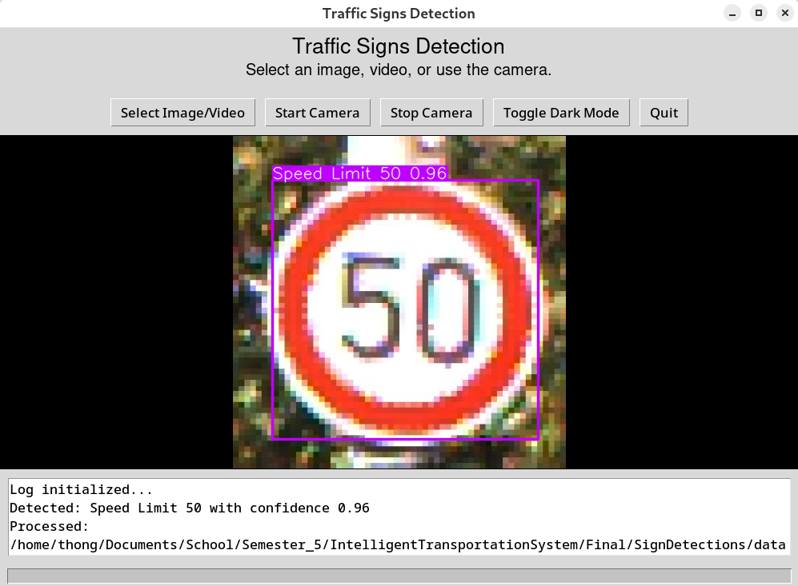

# Traffic Signs Detection Using YOLOv8

This project uses the YOLOv8 model to detect traffic signs in images and videos. It provides a graphical user interface (GUI) for selecting images/videos, sending them to the model for detection, and rendering the results.

